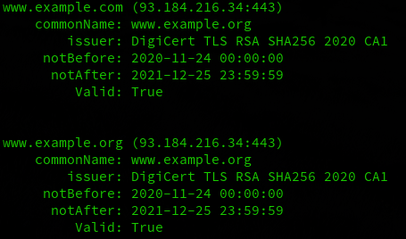

Running checkcert
=================

This section assumes that checkcert is installed via pypi, and the ``certcheck`` entry-point in the path (which ``pip install checkcert`` should do automatically).  If running from source, the full path to python and the checkcert.py script itself would need to be specified.

Basic query
-----------

To do a simple validation, run something like ``checkcert www.example.com``.  You should get output like:

   Basic command output

The green text is showing that the certificate is valid.  If the certificate had expired, the text would be displayed in Red.  The ``--valid`` option may be specified to display a text represention of the cert validity in addtion to just coloring the output to show validity.  When run with ``--valid``, the output will look like:

   Display cert validity in output text

.. note:: Output color is generated via Click's styling which should be aware of how the text is being handled and appropriately strip out the color sequences if output is being piped to another command, for example.  The plain text output may be enforced with the ``--no-color`` option

Querying multiple domains
-------------------------

Multiple domains can be checked from a single command.  Simply separate them on the command line with a space.  So to check `www.example.com` and `www.example.org`, this can be run as:

``checkcert www.example.com www.example.org``

Which will generate:

   Mutliple domains specified

Specify alternate ports
-----------------------

By default, the standard port `443` will be used.  If a service is running on an alternate port, simply append `:portnum` to the domain.  So if example.com was listening on 444 instead of 443, anywhere the domain is specified, the format ``example.com:444`` may be used instead.

Domains from a file
-------------------

While specifying a few domains on the commanline is fine, if there are many domains to check, an input file may be specified instead.  Each domain should be on its own line.  Alternate ports may be specified in this file too.  For example, if a file named `domains.txt` is created with the following content:

.. code-block:: text

   www.example.com
   example.org
   example.com:444

Then checkcert may be run as follows:

``checkcert --filename domains.txt``

Each line in the file will be parsed and checked the same as if it were run on the command line.

SubjectAlternateName handling
-----------------------------

checkcert has a `--san` option that will optionally show the subjectAlternateNames for a domain.  This will output the same as previous iterations, but will add a list of SANs associated with the certificate retrieved.

   output with the SAN line

Just the SANs
^^^^^^^^^^^^^

It may be useful to output just the SANs for a given domain.  This may be done by specifying the ``--san-only`` option.  By default this will output all of SANs, separated by a space.

Running ``checkcert --san-only www.example.com`` will yield::

    www.example.org example.com example.edu example.net example.org www.example.com www.example.edu www.example.net

If an alternate separator is desired, add the ``--sep <separator>`` option, so for comma separated, run ``checkcert --san-only --sep , www.example.com`` which will yield::

    www.example.org,example.com,example.edu,example.net,example.org,www.example.com,www.example.edu,www.example.net

If it is desired to output that list to another command as commandline options (for example when migrating from a managed PKI front-end to using ACME/certbot). Certbot wants the domains specified as -d.  checkcert may run as: ``checkcert --san-only --sep " -d "- www.example.com`` which will return::

    www.example.org -d example.com -d example.edu -d example.net -d example.org -d www.example.com -d www.example.edu -d www.example.net

.. note:: the documentation for certbot specifies multiple domains should be specified each with their own '-d' option.  certbot in particular seems to work with a comma-separated list too, even though the docs don't specify that it works that way.

Notice that the " -d " is used as a **separator** and therefore the first entry does not have a -d before it.  To make -d show up before every entry (as would be required in this case) you must also add --pre to "prefix" the entry with the separator; thus, running ``checkcert --san-only --sep " -d " --pre www.example.com`` will yield::

    -d www.example.org -d example.com -d example.edu -d example.net -d example.org -d www.example.com -d www.example.edu -d www.example.net

.. note:: Since this is utilizing separator in a slightly different way, the space before the option must be specified, otherwise everything would run together.  checkcert is aware of this and will strip off the space at the beginning if ``--pre`` is used.

This output could be directly included into certbot as ``certbot $(checkcert --san-only --sep " -d " --pre www.example.com")``

.. note:: Certbot was the specific reason this was added.  As such, it will prepend the name queried to the list.  The domain itself is not always included in the SAN list, checkcert will verify if the domain is in the list and will always prefix it if not.  If example.com was not in the list of SANS, but ``checkcert --san --pre --sep " -d " example.com`` was used, '-d example.com' will be the first entry even if it was not part of the SANs.

Dumping the text version of a cert
----------------------------------

``--dump`` will give you the textual version of the certificate presented.  Running ``checkcert --dump www.example.com`` will return::

    Certificate:
        Data:
            Version: 3 (0x2)
            Serial Number:
                0f:be:08:b0:85:4d:05:73:8a:b0:cc:e1:c9:af:ee:c9
            Signature Algorithm: sha256WithRSAEncryption
            Issuer: C=US, O=DigiCert Inc, CN=DigiCert TLS RSA SHA256 2020 CA1
            Validity
                Not Before: Nov 24 00:00:00 2020 GMT
                Not After : Dec 25 23:59:59 2021 GMT
            Subject: C=US, ST=California, L=Los Angeles, O=Internet Corporation for Assigned Names and Numbers, CN=www.example.org
            Subject Public Key Info:
                Public Key Algorithm: rsaEncryption
                    RSA Public-Key: (2048 bit)
                    Modulus:
                        00:ba:fc:ee:cc:ca:0a:08:ff:0e:93:1d:b3:be:0b:
                        9c:03:96:22:9e:b1:4f:10:ae:51:40:fd:53:5f:b3:
                        c4:61:40:28:04:ee:a2:e6:12:00:b0:82:85:98:5c:
                        6d:5b:6b:20:84:44:62:95:4e:6b:76:7c:50:70:5d:
                        df:13:1d:ec:63:83:ad:63:a5:52:04:f2:cf:84:ba:
                        db:2a:8c:c7:2e:b4:3c:64:df:eb:61:36:fe:86:03:
                        54:79:3e:cd:03:59:8f:ef:c2:04:93:10:23:e2:a1:
                        b9:b6:58:b8:26:ae:35:68:26:d4:94:2b:7b:7a:ab:
                        86:5e:89:08:9a:10:be:51:8e:48:a5:01:19:4b:4b:
                        4a:0f:8b:ee:da:4b:19:d3:84:1e:b6:9d:24:f2:35:
                        9d:02:f3:00:db:b5:b7:13:08:07:1c:d7:95:19:66:
                        c9:3c:2d:03:9f:b4:6a:3f:0d:77:af:b8:45:c9:2e:
                        53:a6:57:b2:c2:37:58:d6:70:7b:69:de:a4:71:95:
                        d9:6c:47:1a:15:9e:d9:b9:ea:c0:e9:19:0f:18:4f:
                        8f:b2:76:51:6f:5a:05:26:46:28:5e:29:ac:ba:f9:
                        15:16:15:9e:1d:05:c2:18:2d:5c:b8:35:92:ac:cd:
                        dc:a5:0b:ce:cc:a1:f6:bd:2e:dd:d7:9f:b3:1a:5b:
                        38:23
                    Exponent: 65537 (0x10001)
            X509v3 extensions:
                X509v3 Authority Key Identifier: 
                    keyid:B7:6B:A2:EA:A8:AA:84:8C:79:EA:B4:DA:0F:98:B2:C5:95:76:B9:F4

                X509v3 Subject Key Identifier: 
                    26:1A:F8:E4:B1:B0:72:84:CE:DA:81:06:D2:27:98:FB:ED:3A:3D:17
                X509v3 Subject Alternative Name: 
                    DNS:www.example.org, DNS:example.com, DNS:example.edu, DNS:example.net, DNS:example.org, DNS:www.example.com, DNS:www.example.edu, DNS:www.example.net
                X509v3 Key Usage: critical
                    Digital Signature, Key Encipherment
                X509v3 Extended Key Usage: 
                    TLS Web Server Authentication, TLS Web Client Authentication
                X509v3 CRL Distribution Points: 

                    Full Name:
                      URI:http://crl3.digicert.com/DigiCertTLSRSASHA2562020CA1.crl

                    Full Name:
                      URI:http://crl4.digicert.com/DigiCertTLSRSASHA2562020CA1.crl

                X509v3 Certificate Policies: 
                    Policy: 2.16.840.1.114412.1.1
                      CPS: https://www.digicert.com/CPS
                    Policy: 2.23.140.1.2.2

                Authority Information Access: 
                    OCSP - URI:http://ocsp.digicert.com
                    CA Issuers - URI:http://cacerts.digicert.com/DigiCertTLSRSASHA2562020CA1.crt

                X509v3 Basic Constraints: critical
                    CA:FALSE
                CT Precertificate SCTs: 
                    Signed Certificate Timestamp:
                        Version   : v1 (0x0)
                        Log ID    : F6:5C:94:2F:D1:77:30:22:14:54:18:08:30:94:56:8E:
                                    E3:4D:13:19:33:BF:DF:0C:2F:20:0B:CC:4E:F1:64:E3
                        Timestamp : Nov 24 19:32:04.334 2020 GMT
                        Extensions: none
                        Signature : ecdsa-with-SHA256
                                    30:46:02:21:00:A4:6B:A8:D0:43:A4:F1:07:32:2D:ED:
                                    9C:39:7D:77:E8:73:C1:9F:ED:22:4A:00:C5:BE:9A:C9:
                                    B5:B6:12:DC:B1:02:21:00:8D:E8:5F:8A:C7:52:CD:0D:
                                    A1:23:D5:B5:BB:DB:DB:62:13:88:22:D6:70:EC:83:5E:
                                    3F:C9:AC:94:4C:8C:58:3A
                    Signed Certificate Timestamp:
                        Version   : v1 (0x0)
                        Log ID    : 5C:DC:43:92:FE:E6:AB:45:44:B1:5E:9A:D4:56:E6:10:
                                    37:FB:D5:FA:47:DC:A1:73:94:B2:5E:E6:F6:C7:0E:CA
                        Timestamp : Nov 24 19:32:04.429 2020 GMT
                        Extensions: none
                        Signature : ecdsa-with-SHA256
                                    30:45:02:20:6A:AC:11:FA:05:09:12:FF:9B:8E:89:30:
                                    DF:0E:05:6E:CA:8E:59:CC:ED:B5:C2:0A:3C:33:34:A8:
                                    B0:33:DA:AC:02:21:00:DA:D8:5C:51:6D:64:0A:A6:AA:
                                    3D:8B:35:20:13:3A:6A:97:4F:76:B9:67:CB:BE:FC:CC:
                                    A4:57:67:B4:3F:1B:BD
        Signature Algorithm: sha256WithRSAEncryption
             a7:2a:10:30:5c:b8:6b:7a:1b:f8:66:38:f6:e9:a0:0a:d5:13:
             82:82:f8:65:89:57:a5:b8:eb:13:29:1d:84:6c:ec:fb:e3:05:
             11:d7:1e:31:5e:0e:e2:c0:00:e5:6d:06:48:be:3d:55:6f:ba:
             b7:11:35:b6:ea:c4:cf:84:f1:30:4c:bb:33:9e:11:17:2b:c9:
             d2:19:4b:2c:d0:ad:5f:17:23:84:e1:df:17:a2:3b:a8:7f:69:
             29:7c:48:a6:61:5f:26:3f:75:e2:3b:5b:a3:36:b3:1c:cd:e3:
             04:57:30:1f:fc:c9:fa:4b:8e:48:80:58:27:9c:a2:c7:c3:26:
             dc:17:02:fa:e6:6c:ea:81:01:5c:92:8f:d3:18:08:17:70:7a:
             c2:a3:4b:6c:3a:fa:e3:cf:f6:fe:7e:c9:56:e5:a5:4e:1b:14:
             4f:a9:98:9d:79:b1:1e:c3:ab:b1:0d:15:85:a9:46:b6:e5:c2:
             58:e8:5a:fe:c8:14:28:68:90:c6:b8:c8:94:7f:e1:0f:89:fa:
             a7:d6:09:37:a1:62:b7:00:27:b5:be:f1:b1:5e:45:28:06:b3:
             54:15:e6:c3:c8:ac:82:01:ce:86:e2:2b:e1:7a:e4:bd:4c:cb:
             9c:5e:d0:62:c2:61:bd:8b:5a:62:b6:76:30:bc:46:0f:e3:45:
             23:c0:64:5f
